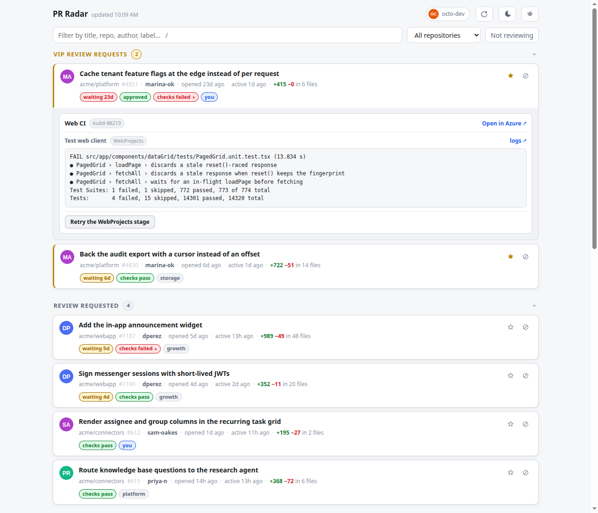
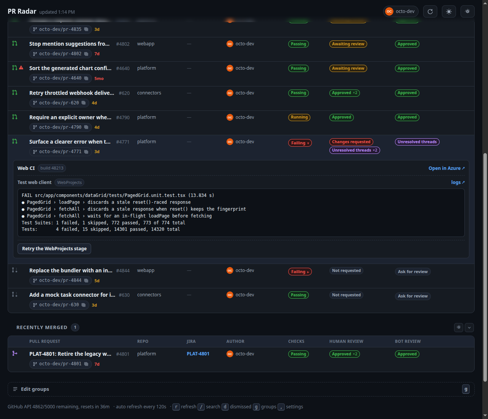
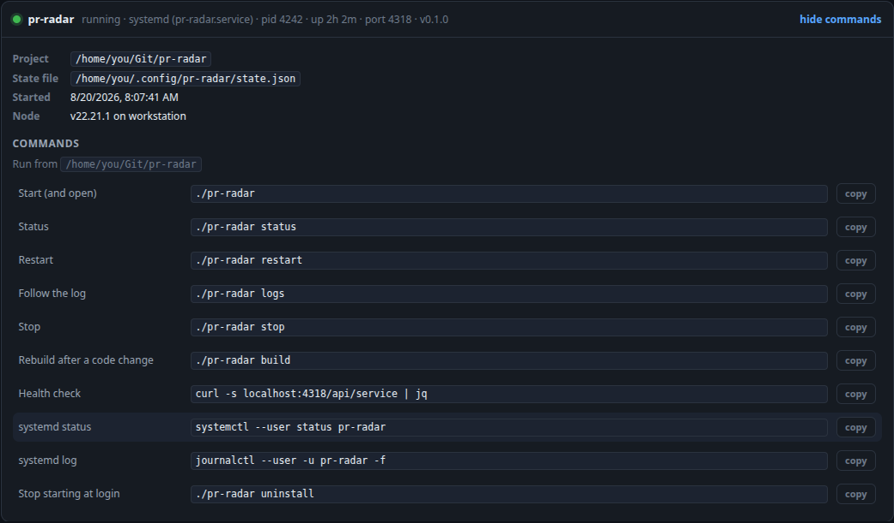

# PR Radar

A local dashboard for the pull requests that actually need you.



<sub>All screenshots use the built-in demo dataset, not real pull requests.</sub>

## What it does

- **Groups you define** — every section on the page is a group you can name, filter, reorder,
  and edit in place from its own gear button. *Edit groups* at
  the bottom of the page (<kbd>g</kbd>) opens the full editor, where nothing is saved until you
  say so. Ships with two sections for pull requests waiting on you — VIP PR reviews and PR Review
  Requests — then one for each stage of your own work; change them or throw them away.
- **One table, one row per pull request** — status, name, repo, Jira issue, author, checks,
  human review, bot review and feedback, each its own column. Drag any column edge to resize it,
  double click to reset; the name column takes whatever is left.
- **One value per column** — status, author, human review, bot review, feedback and checks each
  ask one question, and exactly one of their values is true of any pull request. Nothing stacks,
  so a set of groups either covers every pull request exactly once or it does not. The shipped set
  does, and it is the flow your own work moves through: *Merge ready*, *Approved comments open*,
  *Human reviewed*, *Awaiting human review*, *Bot reviewed*, *Drafts*, under the two sections for
  everyone else's. Merged and closed pull requests are never fetched, so every row is live work.
- **Filters are the columns** — a group narrows any column to the values you pick from a
  multi-select, and *All* is the default. Several values in one column match any of them;
  different columns must all match. What a row shows is exactly what a group can filter on.
  Author is *You*, *VIP* or *Everyone else*, so a group asks for your own pull requests the
  same way it asks for anything else rather than through a separate setting.
- **Review state, split human from bot** — human review is *not requested*, *requested*,
  *changes requested*, *approved* or *commented*: one reviewer asking for changes outranks an
  approval, and an approval outranks a bare comment. Bot review stops at *not requested*,
  *requested*, *completed*, because a bot's verdict is not one anybody merges on. The author is
  not one of its own reviewers either: answering a bot on your own pull request is recorded as a
  review, and counting it would say a human had looked when none had.
- **Feedback is its own question** — *unresolved threads* or *none*, people and bots together,
  because an open thread is work to do whoever opened it. Threads the author started do not
  count: a question you asked on your own pull request is not feedback you owe. This is what
  separates *Merge ready* from *Approved, comments open*.
- **Per-group notifications** — mark any group *Notify* and get a desktop notification the
  moment a pull request lands in it.
- **A color per group** — pick a hue and the whole group takes it: heading, count, table and
  rows, in both themes from that one number. The hue is spelled out next to the slider, so the
  same color can be given to another group; clear it to go back to the default.
- **Branch name and Jira issue on every row** — click the branch to copy it; the issue key
  in the title gets its own column, linked straight to Jira.
- **Not going to review** — set a pull request aside and it stops showing until you toggle
  *Not reviewing*. It stays in the groups it belongs to. Reversible any time.
- **Nudge a bot on a draft** — on a draft whose bot review is *Not requested*, that cell is a
  button that comments whatever you set as *Ask a bot for review* in settings, `@coderabbitai
  review` by default. Empty text hides it.
- **Shareable config** — everything in settings, groups included, is one JSON file. *Export
  config* writes it without your set-aside pull requests, so a teammate can import it as is.
- **Failing checks, explained inline** — click a `Failing` pill to expand the failing tests
  pulled straight out of the Azure Pipelines logs, then retry just the failed stage.
- **Every value explains itself** — hover any pill or status icon for the rule that put it there,
  or press <kbd>?</kbd> for the whole set, column by column. The rules live next to the code that
  decides them, so the window cannot drift from what the table does.
- Light and dark themes, text and repo filters, keyboard shortcuts (<kbd>r</kbd> refresh,
  <kbd>/</kbd> search, <kbd>d</kbd> dismissed, <kbd>g</kbd> groups, <kbd>,</kbd> settings,
  <kbd>?</kbd> help), auto refresh.



## Install

You need [Node](https://nodejs.org) 20+, [pnpm](https://pnpm.io), and the
[GitHub CLI](https://cli.github.com).

```bash
git clone https://github.com/Hashiphoto/pr-radar.git ~/Git/pr-radar
cd ~/Git/pr-radar
gh auth login          # skip if you already use gh
pnpm install
pnpm build
./pr-radar install     # run it as a background service, starting at login
```

That's it — it opens at <http://localhost:4317>.

Prefer not to install a service? Use `./pr-radar` instead of the last line to start it
just for this session.

## Managing it

| Command | |
| --- | --- |
| `./pr-radar` | Start it and open the browser |
| `./pr-radar status` | Health, pid, uptime |
| `./pr-radar restart` | Restart |
| `./pr-radar logs` | Follow the log |
| `./pr-radar stop` | Stop |
| `./pr-radar build` | Rebuild after changing the code |
| `./pr-radar install` | Install the background service |
| `./pr-radar uninstall` | Remove it |

The same information and commands are at the bottom of the page.



## Optional extras

**Retrying CI.** Reading failure details and retrying builds needs Azure DevOps access.
It reuses your existing `az login`, so usually just:

```bash
az login
```

Or set `AZURE_DEVOPS_PAT` to a token with **Build (read and execute)**. Without either,
the panel still lists failing checks and links to Azure.

**Notifications.** Turn on *Desktop notifications* in settings (`,`), grant the browser's
prompt, then mark the groups you care about *Notify*. They fire while a PR Radar tab is open —
the first load after a reload only establishes the baseline, so you are told about arrivals
rather than about what was already waiting. Redefining a group re-establishes that baseline too,
so widening its filters does not announce everything it sweeps in.

**Jira links.** Set *Jira base URL* in settings to something like
`https://your-org.atlassian.net/browse`, and the Jira column links the first issue key in each title.

**Config.** Settings and groups live in `~/.config/pr-radar/state.json`, alongside the pull
requests you have set aside; `PR_RADAR_STATE` moves the file. *Export config* and *Import config*
at the bottom of settings (`,`) round-trip the settings half of it as `pr-radar-config.json`, so
sharing a set of groups is one file rather than a hand-edit. Importing replaces every setting in
the file it names and leaves your set-aside list alone.

**A nicer URL.** Add this to `/etc/hosts` for <http://pr-radar.test:4317>:

```
127.0.0.1   pr-radar.test
```

**Keep it running after logout.**

```bash
sudo loginctl enable-linger "$USER"
```

**Try it without GitHub.** `PR_RADAR_DEMO=1 pnpm dev:server` serves a fake dataset.

## Notes

Settings and dismissals live in `~/.config/pr-radar/state.json`. The server binds to
loopback only, since it exposes your private pull requests — set `HOST` to override.
GitHub auth comes from `PR_RADAR_TOKEN`, `GITHUB_TOKEN`, `GH_TOKEN`, or the `gh` CLI, in
that order; a manual token needs the `repo` and `read:org` scopes.

## License

MIT
